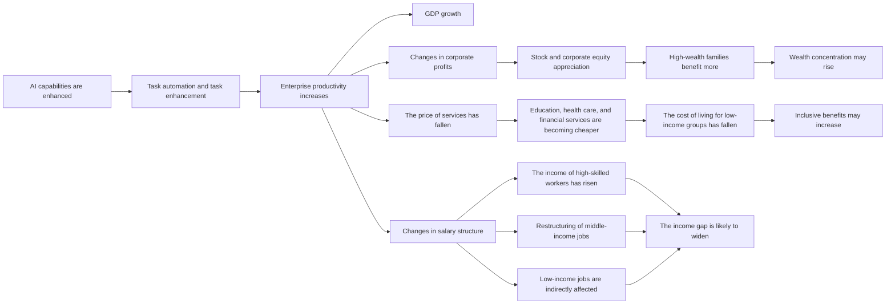
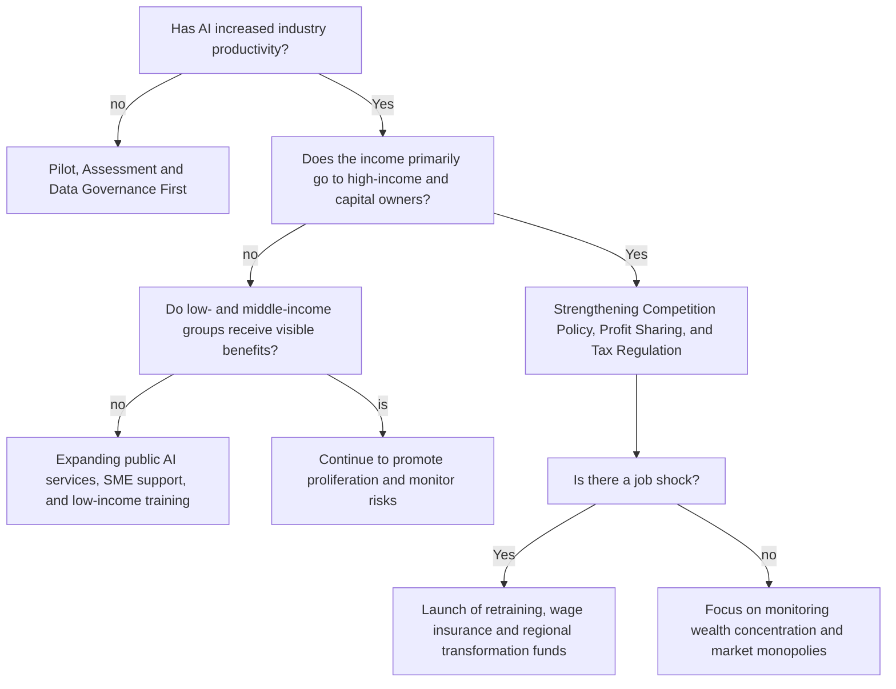

# econ1626-ai-future-forecast

**Author:JIANG ZI JIAN** 
## Article Summary: Sources, Assumptions, AI Tool Disclosures and Limitations

This paper adopts the analytical framework of "task-enterprise-income group-wealth distribution". Unlike studies that only focus on GDP growth, this paper focuses on the differentiated impact of AI on different income groups. The main references include: the International Monetary Fund (IMF), the Organization for Economic Co-operation and Development (OECD), the McKinsey Global Institute, Goldman Sachs, the Stanford AI Index, and experimental studies on generative AI to improve productivity in areas such as customer service, writing, and programming.

The scenario estimation in this paper is based on five assumptions: First, AI exposure is not equal to the replacement rate. Second, the adoption rate of enterprises determines whether the technology can truly enter the production process. Third, the degree of organizational restructuring affects the size of productivity gains. Fourth, asset ownership determines the distribution pattern of wealth income. Fifth, public service and training policies can change the actual level of benefits for low-income groups. 

This paper has the following obvious limitations. First, there is a lack of transparency in real AI usage data at the enterprise level. Second, it is difficult to accurately measure the benefits of AI for different income groups, as it involves multiple factors such as wage changes, service prices, public service quality, and asset returns. Third, the development of AI technology capabilities is uncertain, and AI systems may advance rapidly or be constrained by reliability and security issues. Fourth, structural fractures could revolutionize all scenarios, such as major AI safety incidents, energy supply bottlenecks, regulatory fragmentation, geotechnical blockades, or technological breakthroughs close to the level of general artificial intelligence.

Figure 1: The transmission mechanisms of AI affecting different income groups

Table 1: Three scenario simulations for 2030

| Scenario | GDP gain | Income for high-income groups | Middle-income group benefits | Low-income group benefits | Wealth distribution results |
|---|---|---|---|---|---|
| Downside scenario | 0.5%—1.5% | High | low or negative | low or negative | Obviously more uneven |
| Baseline scenario | 1%—3% | Relative high | Gentle | limited | The slight is more uneven |
| Earnings scenario | 4%—7% | High | Middle and high | Medium or higher | It can be controlled or slightly improved improved |

Figure 2: Overall economic benefits under different scenarios 
GDP relative to baseline gain in 2030

<table>
  <thead>
    <tr>
      <th>Scenario</th>
      <th>Chart</th>
      <th>GDP relative to baseline gain in 2030</th>
    </tr>
  </thead>
  <tbody>
    <tr>
      <td>Downside scenario</td>
      <td>███</td>
      <td>0.5%—1.5%</td>
    </tr>
    <tr>
      <td>Baseline scenario</td>
      <td>█████████</td>
      <td>1%—3%</td>
    </tr>
    <tr>
      <td>Earnings scenario</td>
      <td>██████████████████████████</td>
      <td>4%—7%</td>
    </tr>
  </tbody>
</table>

Figure 3: Relative degree of benefit by income group

Relative benefit: low = █，Medium = ███，High = █████

Downside scenario:

<table>
  <tr>
    <td>High-income groups</td>
    <td>█████</td>
  </tr>
  <tr>
    <td>Middle-income group</td>
    <td>█</td>
  </tr>
  <tr>
    <td>low-income groups</td>
    <td>█</td>
  </tr>
</table>

Baseline scenario：

<table>
  <tr>
    <td>High-income groups</td>
    <td>█████</td>
  </tr>
  <tr>
    <td>Middle-income group</td>
    <td>███</td>
  </tr>
  <tr>
    <td>low-income groups</td>
    <td>██</td>
  </tr>
</table>

Earnings scenario:

<table>
  <tr>
    <td>High-income groups</td>
    <td>█████</td>
  </tr>
  <tr>
    <td>Middle-income group</td>
    <td>████</td>
  </tr>
  <tr>
    <td>Low-income groups</td>
    <td>████</td>
  </tr>
</table>

Table 2: Policy timeline

<table>
  <thead>
    <tr>
      <th>time</th>
      <th>Policy focus</th>
      <th>Main actions</th>
      <th>partners</th>
      <th>KPI</th>
    </tr>
  </thead>
  <tbody>
    <tr>
      <td>2025—2026</td>
      <td>Measurement and basic governance</td>
      <td>Build a database of AI adoption, task exposure, and income group impact</td>
      <td>Statistics department, labor department, tax department, research institution</td>
      <td>enterprise AI adoption; changes in wages of different income groups; AI security incidents</td>
    </tr>
    <tr>
      <td>2027—2028</td>
      <td>Proliferation and capacity building</td>
      <td>SME AI Adoption Vouchers; training accounts for low-income workers; Public AI Services</td>
      <td>Schools, trade unions, enterprises, local governments, cloud service providers</td>
      <td>post-retraining employment rate; SME productivity; Accessibility to services for low-income groups</td>
    </tr>
    <tr>
      <td>2029—2030</td>
      <td>Distribution and competition adjustment</td>
      <td>Antitrust, data portability, profit sharing, taxation, and social insurance reform</td>
      <td>competition regulators, financial departments, platform enterprises, and labor organizations</td>
      <td>labor income share; wealth concentration; industrial concentration; Income liquidity</td>
    </tr>
  </tbody>
</table>
# Policy decision tree

## Reference list
Chui M, Hazan E, Roberts R, Singla A, Smaje K, Sukharevsky A, Yee L and Zemmel R (2023) The Economic Potential of Generative AI: the next Productivity Frontier, McKinsey & Company, https://www.mckinsey.com/capabilities/tech-and-ai/our-insights/the-economic-potential-of-generative-ai-the-next-productivity-frontier , [Accessed 10 May 2026].

Briggs J and Kodnani D (2023) The Potentially Large Effects of Artificial Intelligence on Economic Growth (Briggs/Kodnani), Gspublishing.com, https://www.gspublishing.com/content/research/en/reports/2023/03/27/d64e052b-0f6e-45d7-967b-d7be35fabd16.html , [Accessed 10 May 2026].

Acemoglu D (2024) The Simple Macroeconomics of AI *, https://economics.mit.edu/sites/default/files/2024-04/The%20Simple%20Macroeconomics%20of%20AI.pdf , [Accessed 12 May 2026].

Cazzaniga M, Jaumotte F, Li L, Melina G, Panton A, Pizzinelli C, Rockall E and Tavares M (2024) Gen-AI: Artificial Intelligence and the Future of Work, https://www.imf.org/-/media/files/publications/sdn/2024/english/sdnea2024001.pdf , [Accessed 12 May 2026].

Stanford University (2024) The 2024 AI Index Report | Stanford HAI, Stanford.edu, https://hai.stanford.edu/ai-index/2024-ai-index-report , [Accessed 15 May 2026].

Brynjolfsson E, Li D and Raymond LR (2023) Generative AI at Work, National Bureau of Economic Research, https://www.nber.org/papers/w31161 , [Accessed 15 May 2026].

OECD Employment Outlook 2023: Artificial Intelligence and the Labour Market (2023) IOE-EMP, https://industrialrelationsnews.ioe-emp.org/industrial-relations-and-labour-law-july-2023/news/article/oecd-employment-outlook-2023-artificial-intelligence-and-the-labour-market , [Accessed 15 May 2026].

Eloundou T, Manning S, Mishkin P and Rock D (2024) ‘GPTs Are GPTs: Labor Market Impact Potential of LLMs’, Science, 384(6702):1306–1308, doi: https://doi.org/10.1126/science.adj0998 , [Accessed 18 May 2026].

Noy S and Zhang W (2023) ‘Experimental evidence on the productivity effects of generative artificial intelligence’, Science, 381(6654):187–192, doi: https://doi.org/10.1126/science.adh2586 . [Accessed 18 May 2026].
